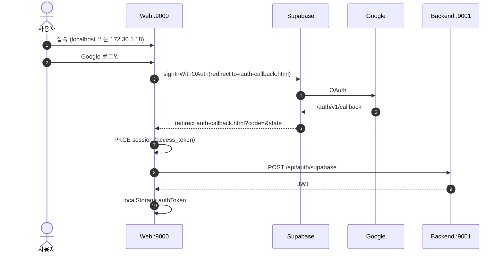

# Google OAuth 인증 흐름 시퀀스 다이어그램

## 1. 전체 흐름

## 다이어그램 설명

| 단계 | 설명 |
|------|------|
| 1 | 사용자가 Web 서버(:9000)에 접속 (localhost 또는 172.30.1.18) |
| 2 | 사용자가 Google 로그인 버튼 클릭 |
| 3 | Web이 Supabase에 `signInWithOAuth` 요청 (redirectTo=auth-callback.html) |
| 4 | Supabase가 Google OAuth 서버로 리다이렉트 |
| 5 | Google이 인증 후 Supabase `/auth/v1/callback`으로 콜백 |
| 6 | Supabase가 Web으로 리다이렉트 (`auth-callback.html?code=&state`) |
| 7 | Web에서 PKCE 세션으로 `access_token` 교환 |
| 8 | Web이 Backend(:9001)에 `POST /api/auth/supabase` 요청 |
| 9 | Backend가 JWT 토큰 발급 및 응답 |
| 10 | Web이 `localStorage`에 `authToken` 저장 |

---

## 2. 참여자 정의

| 참여자 | 역할 | 포트/URL |
|--------|------|----------|
| 사용자 | 최종 사용자 | - |
| Web | 프론트엔드 애플리케이션 | :9000 |
| Supabase | 인증/데이터베이스 서비스 | - |
| Google | OAuth 2.0 제공자 | - |
| Backend | 백엔드 API 서버 | :9001 |
