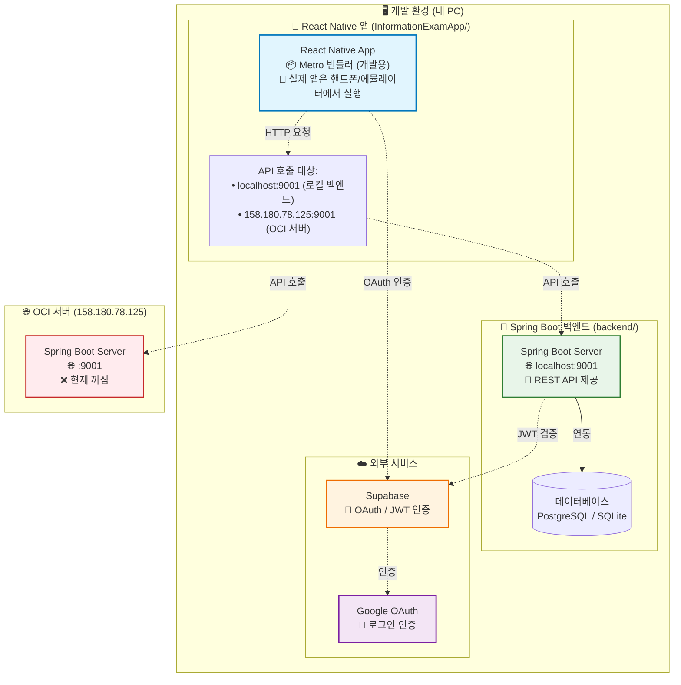
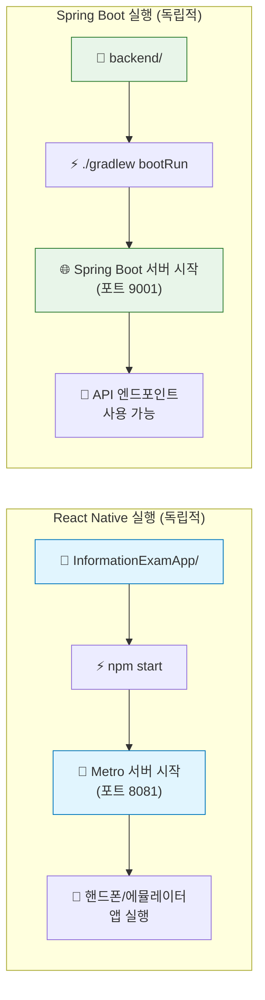
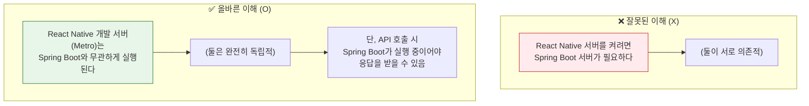

# React Native와 Spring Boot 독립성 아키텍처 다이어그램

## 핵심 개념: React Native ≠ 서버, Spring Boot = 서버

---

## 🎯 핵심 포인트: 둘은 독립적입니다!

| 구분 | React Native (Metro) | Spring Boot |
|------|---------------------|-------------|
| **역할** | 개발용 번들러 (핸드폰으로 코드 전달) | 백엔드 API 서버 |
| **포트** | 기본 8081 (Metro) | 9001 (설정값) |
| **실행 명령** | `npm start` / `npx expo start` | `./gradlew bootRun` |
| **Spring Boot 필요 여부** | ❌ 불필요 | - |
| **React Native 필요 여부** | - | ❌ 불필요 |
| **서버 종속성** | **Spring Boot 없이도 실행됨** | **React Native 없이도 실행됨** |

---

## 🔄 실행 흐름 비교

---

## ❌ 잘못된 이해 vs ✅ 올바른 이해

