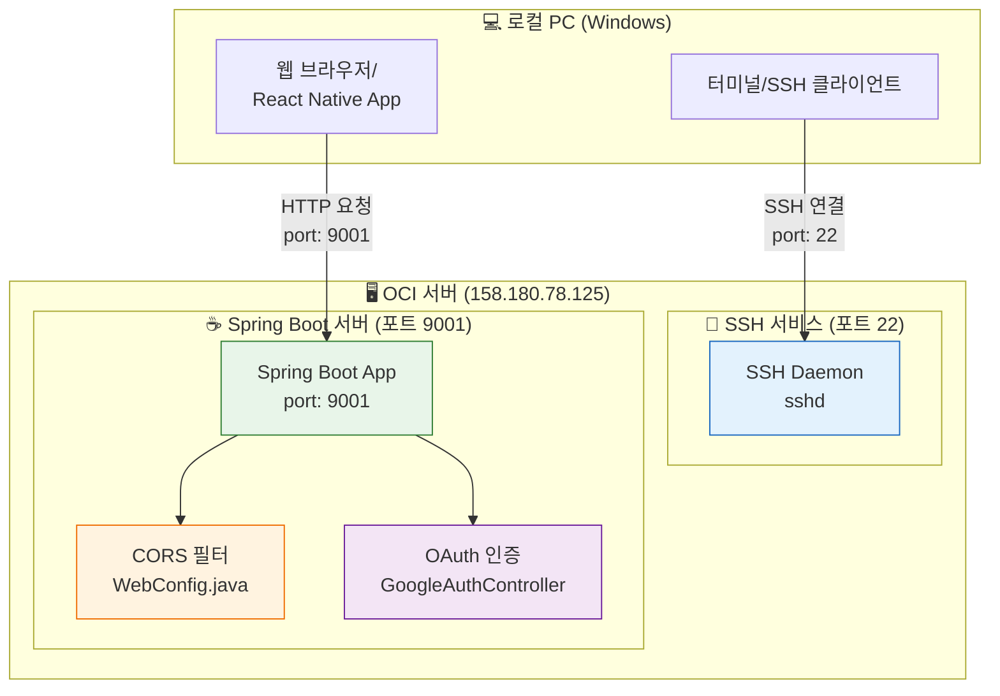
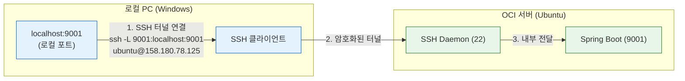
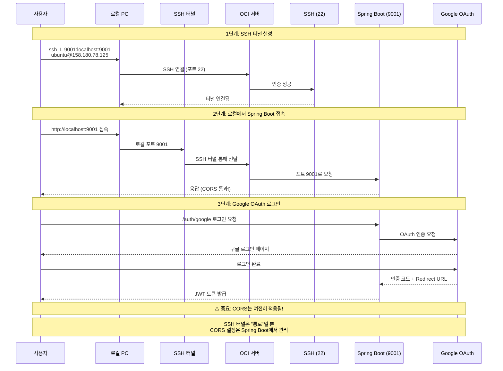
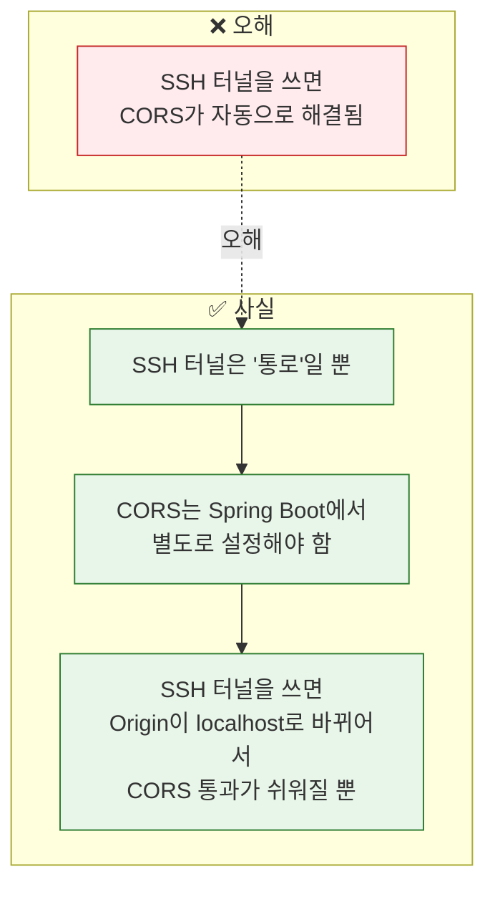

# SSH 터널링과 CORS 관계 완벽 이해

## 1단계: 기본 개념 - SSH와 Spring Boot는 별개

## 2단계: SSH 터널링이란?

## 3단계: SSH 터널링 vs 직접 접속 비교

```mermaid
graph TB
    subgraph "❌ SSH 터널링 없이 직접 접속"
        A1["React Native App"]
        A2["CORS 에러 발생!"]
        A3["Spring Boot (9001)"]
        
        A1 -->|"fetch('http://158.180.78.125:9001/api')<br/>Origin: null 또는 file://"| A3
        A3 -->|"CORS 검사 실패<br/>허용되지 않은 Origin"| A2
    end
    
    subgraph "✅ SSH 터널링 사용 시"
        B1["React Native App"]
        B2["CORS 통과!"]
        B3["Spring Boot (9001)"]
        
        B1 -->|"fetch('http://localhost:9001/api')<br/>Origin: localhost"| B3
        B3 -->|"CORS 검사 통과<br/>localhost 허용됨"| B2
    end
    
    style A2 fill:#ffebee,stroke:#c62828
    style B2 fill:#e8f5e9,stroke:#2e7d32
```

## 4단계: 완전한 흐름도

## 핵심 포인트

## 결론

| 상황 | CORS 적용 여부 | 설명 |
|------|---------------|------|
| SSH 터널 사용 (localhost:9001) | ✅ 적용됨 | Origin이 localhost로 인식됨 |
| 직접 접속 (158.180.78.125:9001) | ✅ 적용됨 | Origin이 IP 주소로 인식됨 |
| SSH 터널 = CORS 해결책 | ❌ 아님 | SSH는 통로일 뿐, CORS는 별개 |

> **결론:** SSH 터널링을 사용하면 로컬 개발 환경에서 편리하게 접속할 수 있지만, **CORS 설정은 여전히 Spring Boot에서 별도로 관리해야 합니다.** SSH 터널이 CORS를 "자동으로 해결"해주는 것은 아닙니다.
