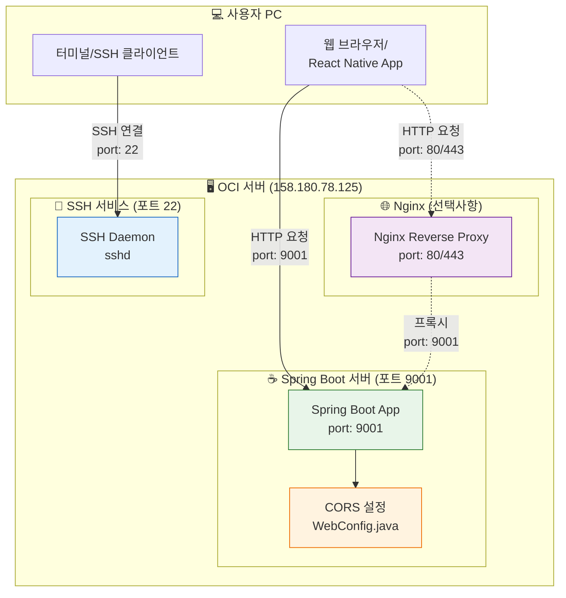
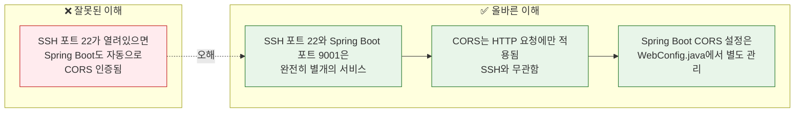
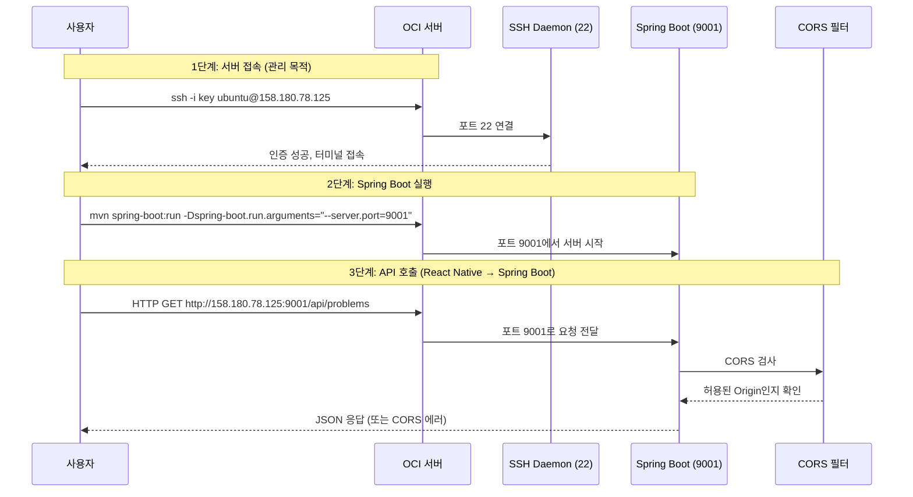

# SSH vs Spring Boot 서버 vs CORS 개념 다이어그램







## 핵심 포인트

| 구분 | SSH (포트 22) | Spring Boot (포트 9001) |
|------|---------------|------------------------|
| **프로토콜** | SSH | HTTP/HTTPS |
| **용도** | 서버 원격 접속/관리 | API 서비스 제공 |
| **CORS 관계** | ❌ 무관 | ✅ 직접 설정 필요 |
| **사용 예** | `ssh ubuntu@158.180.78.125` | `fetch('http://158.180.78.125:9001/api')` |

## CORS 설정 확인 방법

```java
// WebConfig.java - CORS 설정
@Configuration
public class WebConfig implements WebMvcConfigurer {
    @Override
    public void addCorsMappings(CorsRegistry registry) {
        registry.addMapping("/api/**")
            .allowedOrigins(
                "http://localhost:3000",     // 로컬 React
                "http://158.180.78.125:9001" // OCI 서버
            )
            .allowedMethods("GET", "POST", "PUT", "DELETE")
            .allowCredentials(true);
    }
}
```

## 결론

> **SSH 포트 22는 서버 관리용, Spring Boot 포트 9001은 API 서비스용**
> 
> 둘은 완전히 다른 서비스이며, SSH 연결 성공이 CORS 해결을 의미하지 않습니다.
> CORS 문제는 `WebConfig.java`에서 별도로 설정해야 합니다.
