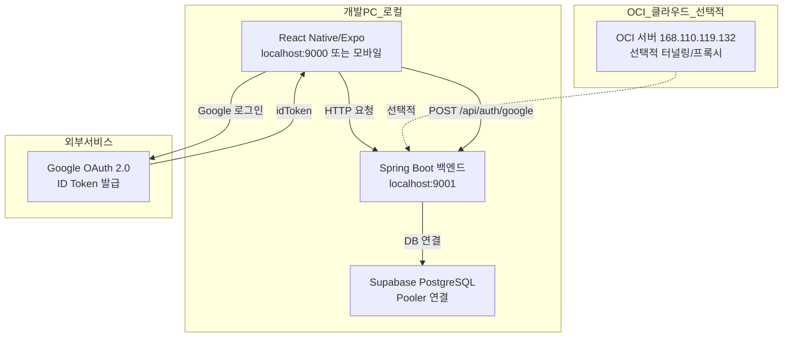

# OCI 클라우드 + 로컬 개발 하이브리드 최종 개발 계획서

> **선택 시나리오**: B. 로컬 개발 + OCI 터널링 (Hybrid)
> **작성일**: 2026-05-27
> **목표**: 로컬 개발 편의성 우선, CORS 완화, Google OAuth + Supabase JWT 연동 원활화

---

## 1. 아키텍처 개요 (Hybrid 모드)



---

## 2. 수정 대상 파일 및 구체적 변경사항

### 2.1 백엔드 CORS 설정 완화

**파일**: [`backend/src/main/java/com/example/informationexam/config/SecurityConfig.java`](backend/src/main/java/com/example/informationexam/config/SecurityConfig.java:62)

**현재 상태**: OCI IP 기반으로 엄격하게 설정되어 있음
**변경 방향**: 로컬 개발 편의성을 위해 와일드카드(`*`) 허용 + 로컬 환경 강화

```java
// DEBUG: [Hybrid-Dev-2026-05-27] 로컬 개발 환경 CORS 완화
// 원인: 로컬 개발 시 다양한 Origin(Expo, React Native, 웹)에서 접근 필요
// 해결: 개발 환경에서는 와일드카드 허용, 운영 환경에서는 환경변수로 제한
// 주의: 운영 배포 시 반드시 ALLOWED_ORIGINS 환경변수로 엄격하게 제한할 것
List<String> allowedOriginPatterns;

String env = System.getenv("SPRING_PROFILES_ACTIVE");
boolean isDev = env == null || env.contains("dev");

if (isDev) {
    // 개발 환경: 모든 Origin 허용 (편의성 우선)
    allowedOriginPatterns = Arrays.asList("*");
    log.warn("[CORS] 개발 환경 - 모든 Origin 허용됨. 운영 배포 시 주의!");
} else {
    // 운영 환경: 환경변수 또는 기본값 사용
    allowedOriginPatterns = Arrays.asList(
        frontendOrigin,
        "http://168.110.119.132:9000",
        "http://168.110.119.132:3000",
        "http://168.110.119.132:19000",
        "http://168.110.119.132:19006",
        "http://localhost:*",
        "http://127.0.0.1:*",
        "exp://*"
    );
}
```

---

### 2.2 프론트엔드 API Base URL 동적 전환

**파일**: [`InformationExamApp/src/services/api.ts`](InformationExamApp/src/services/api.ts:11)

**현재 상태**: OCI IP 하드코딩되어 있음
**변경 방향**: 환경변수/플래그로 로컬/OCI 전환 가능하도록 수정

```typescript
// DEBUG: [Hybrid-Dev-2026-05-27] API Base URL 동적 전환
// 원인: 로컬 개발 vs OCI 배포 시 API 주소가 다름
// 해결: USE_LOCAL_BACKEND 환경변수로 전환
const getApiBaseUrl = () => {
  // 1. 환경변수로 강제 전환 (개발 편의성)
  const forceLocal = process.env.USE_LOCAL_BACKEND === 'true';
  
  if (forceLocal || __DEV__) {
    // 로컬 개발 환경
    const localUrl = 'http://localhost:9001/api';
    console.log('[API Config] 로컬 개발 모드:', localUrl);
    return localUrl;
  }

  // OCI 배포 환경
  const OCI_IP = '168.110.119.132';
  return `http://${OCI_IP}:9001/api`;
};
```

---

### 2.3 Google OAuth Redirect URI 설정

**파일**: [`InformationExamApp/src/screens/AuthScreen.tsx`](InformationExamApp/src/screens/AuthScreen.tsx:24)

**현재 상태**: Web Client ID만 사용
**변경 방향**: 로컬 개발용 redirect URI 추가

```typescript
// DEBUG: [Hybrid-Dev-2026-05-27] 로컬 개발용 redirect URI 설정
// 원인: Google OAuth 콜백이 로컬/원격에 따라 달라짐
// 해결: expo-auth-session의 redirectUri를 동적으로 설정
const [request, response, promptAsync] = Google.useAuthRequest({
  webClientId: GOOGLE_WEB_CLIENT_ID,
  responseType: ResponseType.IdToken,
  scopes: ['openid', 'profile', 'email'],
  // 로컬 개발 시 redirectUri 자동 설정 (expo-auth-session이 처리)
  redirectUri: __DEV__ 
    ? 'http://localhost:9000/auth-callback' 
    : 'http://168.110.119.132:9000/auth-callback',
});
```

---

### 2.4 백엔드 application.properties 개발 환경 분리

**파일**: [`backend/src/main/resources/application.properties`](backend/src/main/resources/application.properties:1)

**현재 상태**: 단일 파일로 모든 환경 관리
**변경 방향**: `application-dev.properties` 분리

```properties
# application-dev.properties (새 파일)
# DEBUG: [Hybrid-Dev-2026-05-27] 개발 환경 전용 설정

# 서버 설정
server.port=9001
server.address=0.0.0.0

# CORS (개발 환경 - 모든 Origin 허용)
frontend.origin=*

# 로깅 강화
logging.level.com.example.informationexam=DEBUG
logging.level.org.springframework.web=DEBUG
```

---

### 2.5 Google Console Redirect URI 등록 (수동 작업)

**Google Cloud Console > API 및 서비스 > 사용자 인증 정보**에서 다음 URI 추가:

```
# 로컬 개발용
http://localhost:9000/auth-callback
http://localhost:9000
http://localhost:19006
exp://localhost:19000/--/auth-callback

# OCI 배포용 (선택적)
http://168.110.119.132:9000/auth-callback
http://168.110.119.132:9000
```

---

## 3. 실행 순서 및 검증 방법

### 3.1 로컬 개발 환경 실행

```bash
# 1. 백엔드 실행 (로컬)
cd backend
./mvnw spring-boot:run -Dspring-boot.run.profiles=dev
# 또는
SPRING_PROFILES_ACTIVE=dev ./mvnw spring-boot:run

# 2. 프론트엔드 실행 (Expo)
cd InformationExamApp
npx expo start --web    # 웹
npx expo start          # 모바일 (Expo Go)
```

### 3.2 CORS 검증

```bash
# OPTIONS 프리플라이트 테스트
curl -X OPTIONS -H "Origin: http://localhost:9000" \
  -H "Access-Control-Request-Method: POST" \
  http://localhost:9001/api/auth/google

# 실제 로그인 요청 테스트
curl -X POST http://localhost:9001/api/auth/google \
  -H "Content-Type: application/json" \
  -d '{"idToken":"test-token"}'
```

### 3.3 Google OAuth 흐름 검증

1. 프론트엔드에서 Google 로그인 버튼 클릭
2. Google OAuth 팝업/리디렉션 수행
3. `idToken` 획득 확인 (브라우저 콘솔 또는 React Native 로그)
4. 백엔드 `/api/auth/google`로 POST 요청
5. 백엔드 JWT 토큰 수신 확인
6. 이후 API 요청 시 `Authorization: Bearer <token>` 헤더 포함

---

## 4. 디버깅 로그 추가 계획

### 4.1 백엔드 로깅 강화

**파일**: [`GoogleAuthController.java`](backend/src/main/java/com/example/informationexam/controller/GoogleAuthController.java:34)

```java
// 기존 로그 유지 + 추가
log.debug("[AUTH][{}][HYBRID] Request Origin: {}", traceId, 
    request.getHeader("Origin"));
log.debug("[AUTH][{}][HYBRID] Request User-Agent: {}", traceId,
    request.getHeader("User-Agent"));
```

### 4.2 프론트엔드 로깅 강화

**파일**: [`api.ts`](InformationExamApp/src/services/api.ts:64)

```typescript
// 요청 인터셉터에 추가
console.log('[API Hybrid] Request URL:', config.baseURL + config.url);
console.log('[API Hybrid] Environment:', __DEV__ ? 'DEV' : 'PROD');
```

---

## 5. 주의사항 및 다음 단계

### 5.1 보안 주의사항
- **개발 환경**: `*` CORS 허용은 편의성을 위한 것이며, 운영 배포 시 반드시 제한할 것
- **Google Client Secret**: 코드 저장소에 노출되지 않도록 `.env` 파일로 분리
- **JWT Secret**: 개발/운영 환경별 다른 Secret 사용

### 5.2 다음 단계 (배포 시)
1. OCI 서버에 백엔드 배포 (`168.110.119.132:9001`)
2. 프론트엔드 빌드 및 배포 (Vercel 또는 OCI 정적 호스팅)
3. Google Console redirect URI를 배포 도메인으로 변경
4. CORS 설정을 운영 환경으로 전환 (`*` 제거, 명시적 Origin 목록 사용)
5. SSL/TLS 인증서 적용 (HTTPS)

---

## 6. 파일 수정 요약

| # | 파일 경로 | 수정 내용 | 중요도 |
|---|-----------|-----------|--------|
| 1 | `backend/src/main/java/com/example/informationexam/config/SecurityConfig.java` | CORS 와일드카드 허용 (개발 환경) | 🔴 필수 |
| 2 | `InformationExamApp/src/services/api.ts` | API Base URL 동적 전환 | 🔴 필수 |
| 3 | `InformationExamApp/src/screens/AuthScreen.tsx` | redirectUri 동적 설정 | 🔴 필수 |
| 4 | `backend/src/main/resources/application-dev.properties` | 개발 환경 설정 분리 | 🟡 권장 |
| 5 | Google Cloud Console | redirect URI 등록 | 🔴 필수 (수동) |

---

**이 계획서를 승인하시면 Code 모드로 전환하여 구체적인 파일 수정을 진행하겠습니다.**
