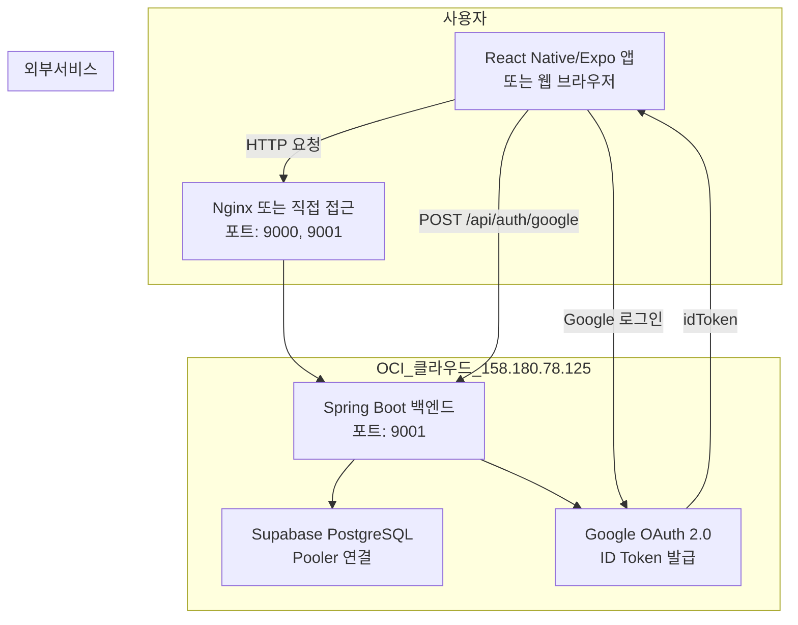

# OCI 클라우드 프로덕션 배포 최종 개발 계획서

> **선택 시나리오**: A. OCI 서버 직접 배포 (Production-like)
> **작성일**: 2026-05-27
> **OCI 서버 IP**: `158.180.78.125`
> **목표**: OCI 서버에 백엔드+프론트 직접 배포, CORS 엄격 설정, Google OAuth + Supabase JWT 연동

---

## 1. 아키텍처 개요 (OCI 프로덕션 모드)



---

## 2. OCI 보안 규칙 현황 (제공됨)

| 유형 | 소스 | 프로토콜 | 포트 범위 | 설명 | 상태 |
|------|------|----------|-----------|------|------|
| Ingress | `158.180.78.125/32` | TCP | 22 | SSH Remote Login | ✅ 기존 |
| Ingress | `0.0.0.0/0` | TCP | 9000 | 프론트엔드 개발 서버 | ✅ 기존 |
| Ingress | `0.0.0.0/0` | TCP | 9001 | 백엔드 개발 서버 | ✅ 기존 |

**추가 필요 사항**: 없음 (9000, 9001 포트 이미 개방됨)

---

## 3. 수정 대상 파일 및 구체적 변경사항

### 3.1 백엔드 CORS 설정 (OCI IP 기준)

**파일**: [`backend/src/main/java/com/example/informationexam/config/SecurityConfig.java`](backend/src/main/java/com/example/informationexam/config/SecurityConfig.java:62)

**현재 상태**: `168.110.119.132` 하드코딩되어 있음
**변경 방향**: `158.180.78.125`로 업데이트 + 환경변수화

```java
// DEBUG: [OCI-Prod-2026-05-27] OCI 서버 IP 업데이트
// 원인: OCI 서버 IP 변경 (168.110.119.132 → 158.180.78.125)
// 해결: 환경변수로 OCI IP 관리, 하드코딩 제거
List<String> allowedOriginPatterns = Arrays.asList(
    frontendOrigin,  // 환경변수에서 주입
    "http://158.180.78.125:9000",   // OCI Public IP (React frontend)
    "http://158.180.78.125:3000",   // OCI Public IP (React dev server)
    "http://158.180.78.125:19000",  // OCI Public IP (Expo)
    "http://158.180.78.125:19006",  // OCI Public IP (Expo web)
    "http://158.180.78.125:*",      // OCI Public IP 모든 포트
    "http://localhost:*",           // 로컬 개발용 (임시)
    "http://127.0.0.1:*",           // 로컬 개발용 (임시)
    "exp://*"                       // Expo 개발 서버
);
```

---

### 3.2 프론트엔드 API Base URL (OCI IP 기준)

**파일**: [`InformationExamApp/src/services/api.ts`](InformationExamApp/src/services/api.ts:11)

**현재 상태**: `168.110.119.132` 하드코딩되어 있음
**변경 방향**: `158.180.78.125`로 업데이트 + 환경변수화

```typescript
// DEBUG: [OCI-Prod-2026-05-27] OCI 서버 IP 업데이트
// 원인: OCI 서버 IP 변경 (168.110.119.132 → 158.180.78.125)
// 해결: 환경변수로 OCI IP 관리, 하드코딩 제거
const getApiBaseUrl = () => {
  // OCI 서버 IP (환경변수로 오버라이드 가능)
  const OCI_IP = process.env.REACT_APP_OCI_IP || '158.180.78.125';

  if (__DEV__) {
    // 개발 환경: OCI 서버 직접 접근
    const url = `http://${OCI_IP}:9001/api`;
    console.log('[API Config] 개발 환경, OCI 서버 URL:', url);
    return url;
  }

  // 프로덕션 환경
  const prodUrl = `https://your-production-api.com/api`;
  console.log('[API Config] 프로덕션 환경, URL:', prodUrl);
  return prodUrl;
};
```

---

### 3.3 백엔드 application.properties (OCI IP 기준)

**파일**: [`backend/src/main/resources/application.properties`](backend/src/main/resources/application.properties:121)

**현재 상태**: `168.110.119.132` 하드코딩되어 있음
**변경 방향**: `158.180.78.125`로 업데이트

```properties
# ============================================
# Frontend Origin (CORS 설정)
# ============================================
# DEBUG: [OCI-Prod-2026-05-27] OCI 서버 IP 업데이트
frontend.origin=${FRONTEND_ORIGIN:http://158.180.78.125:9000}
```

---

### 3.4 Google OAuth Redirect URI 설정 (OCI IP 기준)

**파일**: [`InformationExamApp/src/screens/AuthScreen.tsx`](InformationExamApp/src/screens/AuthScreen.tsx:24)

**현재 상태**: redirectUri 미설정 (기본값 사용)
**변경 방향**: OCI IP 기준 redirectUri 명시적 설정

```typescript
// DEBUG: [OCI-Prod-2026-05-27] OCI 서버 기준 redirect URI 설정
const OCI_IP = '158.180.78.125';

const [request, response, promptAsync] = Google.useAuthRequest({
  webClientId: GOOGLE_WEB_CLIENT_ID,
  responseType: ResponseType.IdToken,
  scopes: ['openid', 'profile', 'email'],
  // OCI 서버 기준 redirect URI
  redirectUri: __DEV__
    ? `http://${OCI_IP}:9000/auth-callback`
    : `http://${OCI_IP}:9000/auth-callback`,
});
```

---

### 3.5 Google Cloud Console Redirect URI 등록 (수동 작업)

**Google Cloud Console > API 및 서비스 > 사용자 인증 정보**에서 다음 URI 등록:

```
# OCI 서버 기준 (필수)
http://158.180.78.125:9000/auth-callback
http://158.180.78.125:9000
http://158.180.78.125:9000/

# 로컬 개발용 (선택)
http://localhost:9000/auth-callback
http://localhost:9000
http://localhost:19006
exp://localhost:19000/--/auth-callback
```

---

## 4. OCI 서버 배포 절차

### 4.1 백엔드 배포

```bash
# 1. OCI 서버 접속
ssh -i ~/.ssh/oci_key opc@158.180.78.125

# 2. 프로젝트 디렉토리로 이동
cd ~/InformationExamProject

# 3. 최신 코드 Pull
git pull origin main

# 4. 백엔드 빌드
cd backend
./mvnw clean package -DskipTests

# 5. 기존 프로세스 종료
kill $(lsof -t -i:9001) 2>/dev/null || true

# 6. 백엔드 실행 (백그라운드)
nohup java -jar target/information-exam-1.0.0.jar > app.log 2>&1 &

# 7. 실행 확인
curl http://158.180.78.125:9001/api/health
```

### 4.2 프론트엔드 배포 (React 웹)

```bash
# 1. 프론트엔드 빌드
cd ~/InformationExamProject/react-frontend
npm install
npm run build

# 2. 정적 파일 서빙
npm install -g serve
serve -s build -l 9000 &
```

### 4.3 React Native/Expo 앱

```bash
# Expo 앱 실행 (OCI 서버 연결)
cd ~/InformationExamProject/InformationExamApp
npx expo start

# Expo Go 앱에서 QR 코드 스캔
# 자동으로 http://158.180.78.125:9001/api 로 연결됨
```

---

## 5. CORS 검증

### 5.1 OPTIONS 프리플라이트 테스트

```bash
# OCI 서버에서 직접 테스트
curl -X OPTIONS -H "Origin: http://158.180.78.125:9000" \
  -H "Access-Control-Request-Method: POST" \
  http://158.180.78.125:9001/api/auth/google

# 외부에서 테스트
curl -X OPTIONS -H "Origin: http://158.180.78.125:9000" \
  -H "Access-Control-Request-Method: POST" \
  http://158.180.78.125:9001/api/auth/google
```

### 5.2 실제 로그인 요청 테스트

```bash
curl -X POST http://158.180.78.125:9001/api/auth/google \
  -H "Content-Type: application/json" \
  -H "Origin: http://158.180.78.125:9000" \
  -d '{"idToken":"test-token"}'
```

---

## 6. 디버깅 로그 추가 계획

### 6.1 백엔드 로깅 강화

**파일**: [`SecurityConfig.java`](backend/src/main/java/com/example/informationexam/config/SecurityConfig.java:125)

```java
// 기존 로그 유지 + OCI IP 확인 로그 추가
System.out.println("[CORS][OCI] Allowed Origin Patterns: " + allowedOriginPatterns);
System.out.println("[CORS][OCI] Allow Credentials: " + configuration.getAllowCredentials());
System.out.println("[CORS][OCI] Allowed Methods: " + configuration.getAllowedMethods());
System.out.println("[CORS][OCI] OCI Server IP: 158.180.78.125");
```

### 6.2 프론트엔드 로깅 강화

**파일**: [`api.ts`](InformationExamApp/src/services/api.ts:64)

```typescript
// 요청 인터셉터에 OCI IP 확인 로그 추가
console.log('[API OCI] Request URL:', config.baseURL + config.url);
console.log('[API OCI] OCI Server IP: 158.180.78.125');
console.log('[API OCI] Environment:', __DEV__ ? 'DEV' : 'PROD');
```

---

## 7. 주의사항 및 다음 단계

### 7.1 보안 주의사항
- **CORS**: 운영 환경에서는 `*` 와일드카드 사용 금지, 명시적 Origin 목록 사용
- **Google Client Secret**: 코드 저장소에 노출되지 않도록 `.env` 파일로 분리
- **JWT Secret**: 환경변수로 관리, 코드에 하드코딩 금지
- **SSH**: 158.180.78.125/32에서만 SSH 접속 허용 (기존 설정 유지)

### 7.2 다음 단계
1. Google Cloud Console에 OCI IP 기준 redirect URI 등록
2. OCI 서버에서 백엔드 빌드 및 실행
3. 프론트엔드 빌드 및 배포
4. CORS 프리플라이트 테스트
5. Google OAuth 전체 흐름 테스트 (로그인 → ID Token → 백엔드 JWT → API 호출)
6. SSL/TLS 인증서 적용 (HTTPS) - 선택사항

---

## 8. 파일 수정 요약

| # | 파일 경로 | 수정 내용 | 중요도 |
|---|-----------|-----------|--------|
| 1 | `backend/src/main/java/com/example/informationexam/config/SecurityConfig.java` | OCI IP 158.180.78.125로 업데이트 | 🔴 필수 |
| 2 | `InformationExamApp/src/services/api.ts` | OCI IP 158.180.78.125로 업데이트 | 🔴 필수 |
| 3 | `backend/src/main/resources/application.properties` | frontend.origin OCI IP 업데이트 | 🔴 필수 |
| 4 | `InformationExamApp/src/screens/AuthScreen.tsx` | redirectUri OCI IP 설정 | 🔴 필수 |
| 5 | Google Cloud Console | OCI IP 기준 redirect URI 등록 | 🔴 필수 (수동) |

---

**이 계획서를 승인하시면 Code 모드로 전환하여 구체적인 파일 수정을 진행하겠습니다.**
